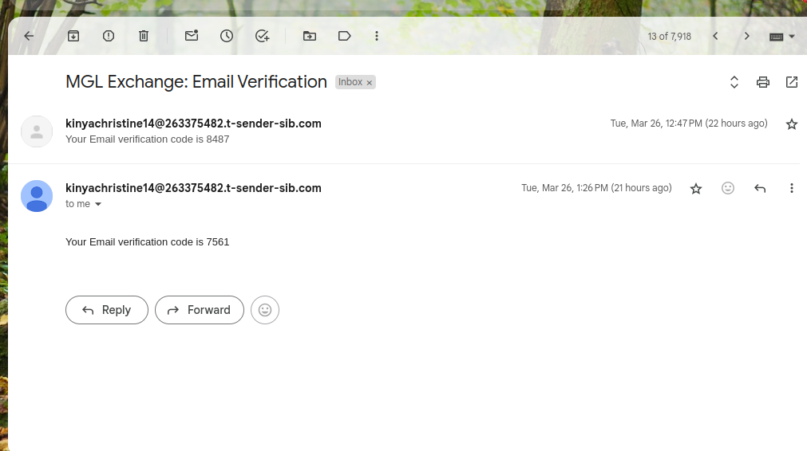

## Mgl Web Application Improvement Report
  
### Introduction

This report outlines the steps taken to fix the email verification feature in the Mgl web application and suggests improvements for the frontend and backend codebases. The improvements include the use of React Hooks for API integration on the frontend and the refactoring of the backend to use NestJS and ORM for database operations.

## Email Verification Fix
 ### Problem Identification
The initial issue with the email verification process was identified as a misconfiguration in the backend service responsible for sending verification emails. This misconfiguration led to failed attempts in sending verification emails to users, thereby affecting the user registration process.

### Solution Implementation
  Configuration Review: The first step was to review the configuration settings for the email service provider (ESP) used by the backend. This involved checking the SMTP settings, API alt textkeys, and any other relevant configurations that might affect email sending.

  Configuration Correction: Upon identifying the misconfiguration, the necessary corrections were made. This included updating the SMTP settings to ensure they were correctly pointing to the ESP's servers, verifying the API keys, and ensuring that the ESP was correctly set up to send emails from the application's domain.

   Testing: After correcting the configuration, a series of tests were conducted to ensure that the email verification process was functioning as expected. This involved sending test emails to verify that they were successfully sent and received, and that the verification links within the emails were working correctly.
   

   ## Add Price of Ethereum to profile page 
   

   ## Improvement Suggestion
   ## Refactoring Backend to Use NestJS and ORM
   ### Modular Structure
   NestJS promotes a modular structure, making the codebase more organized and easier to maintain. This is particularly beneficial for large applications with multiple functionalities.
   ### Dependency Injection
   NestJS's dependency injection system simplifies the management of dependencies, such as database connections and services. This leads to cleaner code and easier testing.
   ### ORM for Database Operations
   Using an ORM abstracts the database operations, making the code cleaner and more maintainable. It also provides a level of abstraction that can make it easier to switch between different database systems if needed.
   ### Migrations
   ORM's migration feature allows for easy database schema changes, ensuring that the database schema is always in sync with the application's data model. This is crucial for maintaining the integrity of the application's data over time.
 ### Performance
 ORM's efficient data handling and query generation can improve the application's performance, especially in scenarios involving complex database operations.

By refactoring the backend to use NestJS and ORM, you can leverage these advantages to create a more robust, maintainable, and scalable application.

